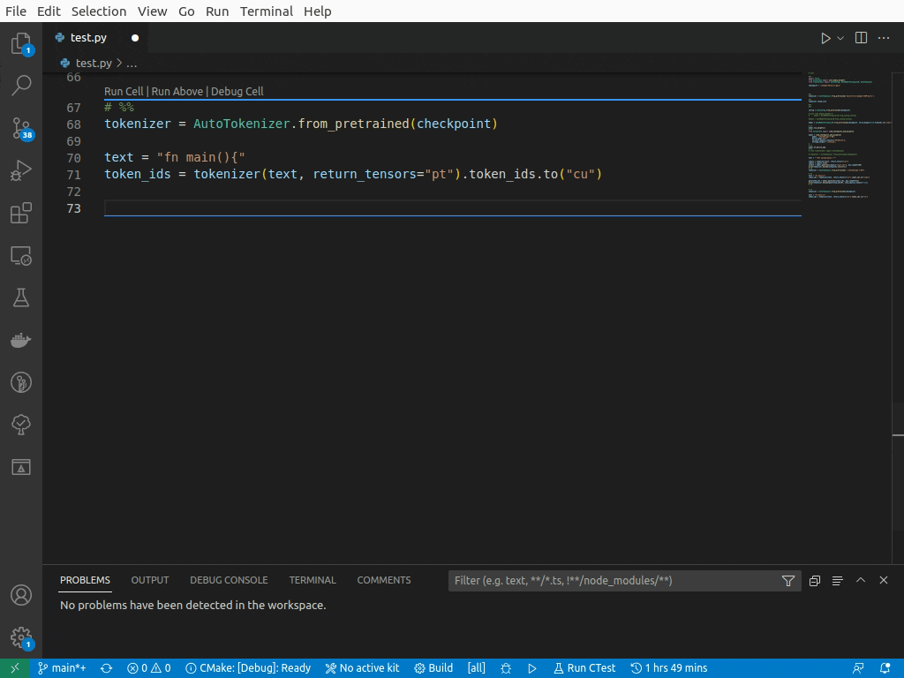

# TurboPilot 🚀

[](https://fosstodon.org/@jamesravey)  


TurboPilot is a self-hosted [copilot](https://github.com/features/copilot) clone which uses the library behind [llama.cpp](https://github.com/ggerganov/llama.cpp) to run the [6 Billion Parameter Salesforce Codegen model](https://github.com/salesforce/CodeGen) in 4GiB of RAM. It is heavily based and inspired by on the [fauxpilot](https://github.com/fauxpilot/fauxpilot) project.

***NB: This is a proof of concept right now rather than a stable tool. Autocompletion is quite slow in this version of the project. Feel free to play with it, but your mileage may vary.***



## 🤝 Contributing

PRs to this project and the corresponding [GGML fork](https://github.com/ravenscroftj/ggml) are very welcome.

Make a fork, make your changes and then open a [PR](https://github.com/ravenscroftj/turbopilot/pulls).


## 👋 Getting Started

The easiest way to try the project out is to grab the pre-processed models and then run the server in docker.

### Getting The Models

You have 2 options for getting the model

#### Option A: Direct Download - Easy, Quickstart

You can download the pre-converted, pre-quantized models from Huggingface.

The `multi` flavour models can provide auto-complete suggestions for `C`, `C++`, `Go`, `Java`, `JavaScript`, and `Python`.

The `mono` flavour models can provide auto-complete suggestions for `Python` only (but the quality of Python-specific suggestions may be higher).

Pre-converted and pre-quantized models are available for download from here:

| Model Name          | RAM Requirement | Supported Languages       | Direct Download  | HF Project Link |
|---------------------|-----------------|---------------------------|-----------------|-----------------|
| CodeGen 350M multi   | ~800MiB        | `C`, `C++`, `Go`, `Java`, `JavaScript`, `Python`  |   [:arrow_down:](https://huggingface.co/ravenscroftj/CodeGen-350M-multi-ggml-quant/resolve/main/codegen-350M-multi-ggml-4bit-quant.bin)           |   [:hugs:](https://huggingface.co/ravenscroftj/CodeGen-350M-multi-ggml-quant)           |
| CodeGen 350M mono   | ~800MiB   | `Python`          |   [:arrow_down:](https://huggingface.co/Guglielmo/CodeGen-350M-mono-ggml-quant/resolve/main/ggml-model-quant.bin)           |   [:hugs:](https://huggingface.co/Guglielmo/CodeGen-2B-mono-ggml-quant)           |
| CodeGen 2B multi   | ~4GiB  | `C`, `C++`, `Go`, `Java`, `JavaScript`, `Python`          |   [:arrow_down:](https://huggingface.co/ravenscroftj/CodeGen-2B-multi-ggml-quant/resolve/main/codegen-2B-multi-ggml-4bit-quant.bin)           |   [:hugs:](https://huggingface.co/ravenscroftj/CodeGen-2B-multi-ggml-quant)          |
| CodeGen 2B mono   | ~4GiB  | `Python`          |   [:arrow_down:](https://huggingface.co/Guglielmo/CodeGen-2B-mono-ggml-quant/resolve/main/ggml-model-quant.bin)           |   [:hugs:](https://huggingface.co/Guglielmo/CodeGen-2B-mono-ggml-quant/)          |
| CodeGen 6B multi   | ~8GiB  | `C`, `C++`, `Go`, `Java`, `JavaScript`, `Python`          |   [:arrow_down:](https://huggingface.co/ravenscroftj/CodeGen-6B-multi-ggml-quant/resolve/main/codegen-6B-multi-ggml-4bit-quant.bin)           |   [:hugs:](https://huggingface.co/ravenscroftj/CodeGen-2B-multi-ggml-quant)            |   [:hugs:](https://huggingface.co/ravenscroftj/CodeGen-6B-multi-ggml-quant)          |
| CodeGen 6B mono   | ~8GiB  | `Python`          |   [:arrow_down:](https://huggingface.co/Guglielmo/CodeGen-6B-mono-ggml-quant/resolve/main/ggml-model-quant.bin)           |   [:hugs:](https://huggingface.co/Guglielmo/CodeGen-6B-mono-ggml-quant/)          |


#### Option B: Convert The Models Yourself - Hard, More Flexible

Follow [this guide](https://github.com/ravenscroftj/turbopilot/wiki/Converting-and-Quantizing-The-Models) if you want to experiment with quantizing the models yourself.

### ⚙️ Running TurboPilot Server

Download the [latest binary](https://github.com/ravenscroftj/turbopilot/releases) and extract it to the root project folder. If a binary is not provided for your OS or you'd prefer to build it yourself follow the [build instructions](BUILD.md)

Run:

```bash
./codegen-serve -m ./models/codegen-6B-multi-ggml-4bit-quant.bin
```

The application should start a server on port `18080`

If you have a multi-core system you can control how many CPUs are used with the `-t` option - for example, on my AMD Ryzen 5000 which has 6 cores/12 threads I use:

```bash
./codegen-serve -t 6 -m ./models/codegen-6B-multi-ggml-4bit-quant.bin
```

### 📦 Running From Docker

You can also run Turbopilot from the pre-built docker image supplied [here](https://github.com/users/ravenscroftj/packages/container/package/turbopilot)

You will still need to download the models separately, then you can run:

```bash
docker run --rm -it \
  -v ./models:/models \
  -e THREADS=6 \
  -e MODEL="/models/codegen-2B-multi-ggml-4bit-quant.bin" \
  -p 18080:18080 \
  ghcr.io/ravenscroftj/turbopilot:latest
```

### 🌐 Using the API

#### Support for the official Copilot Plugin

Support for the official VS Code copilot plugin is underway (See ticket #11). The API should now be broadly compatible with OpenAI.

#### Using the API with FauxPilot Plugin


To use the API from VSCode, I recommend the vscode-fauxpilot plugin. Once you install it, you will need to change a few settings in your settings.json file.

- Open settings (CTRL/CMD + SHIFT + P) and select `Preferences: Open User Settings (JSON)`
- Add the following values:

```json
{
    ... // other settings

    "fauxpilot.enabled": true,
    "fauxpilot.server": "http://localhost:18080/v1/engines",
}
```

Now you can enable fauxpilot with `CTRL + SHIFT + P` and select `Enable Fauxpilot`

The plugin will send API calls to the running `codegen-serve` process when you make a keystroke. It will then wait for each request to complete before sending further requests.

#### Calling the API Directly

You can make requests to `http://localhost:18080/v1/engines/codegen/completions` which will behave just like the same Copilot endpoint.

For example:

```bash
curl --request POST \
  --url http://localhost:18080/v1/engines/codegen/completions \
  --header 'Content-Type: application/json' \
  --data '{
 "model": "codegen",
 "prompt": "def main():",
 "max_tokens": 100
}'
```

Should get you something like this:

```json
{
 "choices": [
  {
   "logprobs": null,
   "index": 0,
   "finish_reason": "length",
   "text": "\n  \"\"\"Main entry point for this script.\"\"\"\n  logging.getLogger().setLevel(logging.INFO)\n  logging.basicConfig(format=('%(levelname)s: %(message)s'))\n\n  parser = argparse.ArgumentParser(\n      description=__doc__,\n      formatter_class=argparse.RawDescriptionHelpFormatter,\n      epilog=__doc__)\n  "
  }
 ],
 "created": 1681113078,
 "usage": {
  "total_tokens": 105,
  "prompt_tokens": 3,
  "completion_tokens": 102
 },
 "object": "text_completion",
 "model": "codegen",
 "id": "01d7a11b-f87c-4261-8c03-8c78cbe4b067"
}
```

## 👉 Known Limitations

Again I want to set expectations around this being a proof-of-concept project. With that in mind. Here are some current known limitations.

As of **v0.0.2**:
- The models can be quite slow - especially the 6B ones. It can take ~30-40s to make suggestions across 4 CPU cores.
- I've only tested the system on Ubuntu 22.04 but I am now supplying ARM docker images and soon I'll be providing ARM binary releases.
- Sometimes suggestions get truncated in nonsensical places - e.g. part way through a variable name or string name. This is due to a hard limit of 2048 on the context length (prompt + suggestion).

## 👏 Acknowledgements

- This project would not have been possible without [Georgi Gerganov's work on GGML and llama.cpp](https://github.com/ggerganov/ggml)
- It was completely inspired by [fauxpilot](https://github.com/fauxpilot/fauxpilot) which I did experiment with for a little while but wanted to try to make the models work without a GPU
- The frontend of the project is powered by [Venthe's vscode-fauxpilot plugin](https://github.com/Venthe/vscode-fauxpilot)
- The project uses the [Salesforce Codegen](https://github.com/salesforce/CodeGen) models.
- Thanks to [Moyix](https://huggingface.co/moyix) for his work on converting the Salesforce models to run in a GPT-J architecture. Not only does this [confer some speed benefits](https://gist.github.com/moyix/7896575befbe1b99162ccfec8d135566) but it also made it much easier for me to port the models to GGML using the [existing gpt-j example code](https://github.com/ggerganov/ggml/tree/master/examples/gpt-j)
- The model server uses [CrowCPP](https://crowcpp.org/master/) to serve suggestions.
- Check out the [original scientific paper](https://arxiv.org/pdf/2203.13474.pdf) for CodeGen for more info.
